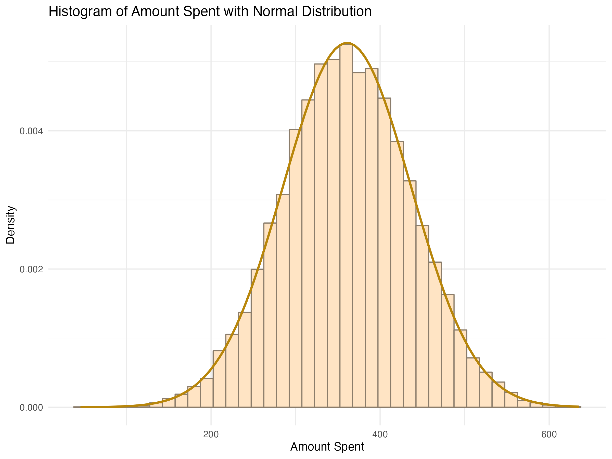

# Data Cleaning and Preparation

The data generated was intended to represent hotel bookings across various room categories and customer segments. Fictional data was created according to established guidelines. The offered products are categorized into five distinct types. Additionally, CustomerID serves as a unique identifier, Amount denotes the transaction value, and TransactionDate records the date of each transaction.

To clean the data, we began with an initial exploration using basic commands to obtain statistical summaries. We also created several graphs to understand the distribution of each variable. This process revealed issues with missing values. For date values, we decomposed the numbers into day, month, and year, which highlighted input errors. We assumed that any numbers below a certain threshold (1900) were erroneous and replaced by combining the value in Day + "20," given that other values were in the 2000s. However, this approach did not fully resolve the issue, as subsequent graphs still showed anomalies. To address this, we planned to flag the modified dates to track them in future graphs. If these flagged dates continued to deviate from the expected parameters and no additional data could be used for correction, we would need to assess their impact on our results and potentially exclude them from the analysis. Care must be taken to avoid bias, particularly if the excluded data is from a specific group and constitutes a significant portion of the dataset. An alternative approach would be to compare results with and without the excluded data to check for significant differences. In our case, since we hadn't directly worked with the Date variable, we opted to retain all the information.

To handle missing values, we employed the MICE package and the Predictive Mean Matching (PMM) method, which works for both continuous and categorical variables. We then removed any duplicate transactions.

At this stage, we could have evaluated outliers in each variable to decide whether to retain or exclude them. We also converted the different date variables (Yr, Month, Month-Yr) to the correct Date format and changed ProductCategory to a factor. Once these adjustments were made, we updated the statistical tables.

# Exploratory Data Analysis

The transaction amount followed a normal distribution, which deviates from our expectations. We anticipated a higher frequency of transactions with lower values, resulting in a right-skewed graph. To understand why the observed distribution differs from expectations, a detailed examination of the data is necessary. Factors to investigate include whether the data is from a specific segment, if it varies across different seasons (low vs. high) or years.

When plotting the data by date, we observe that prices appear to follow a consistent trend throughout the period, which is unexpected. Typically, rates should increase annually, unless influenced by a recession, in which case they might decline. A flat rate over time suggests potential issues with rate optimization. If the data is accurate, it implies that rates should be adjusted at least in line with yearly inflation; otherwise, we risk selling at below-market prices.

Boxplots of the amount spent by product category reveal discrepancies in rates by room type. Generally, suite prices are higher than those of specialty suites, while standard, premier, and specialty suites are quite similar. This may be influenced by the different customer segments. To investigate this further, we need to compare the graphs for each main segment. However, the presidential suite aligns with expected pricing behavior.

Customers are categorized into tiers: Bronze, Silver, Gold, and Platinum, based on their total amount spent or number of transactions.

Bronze clients typically make around 1 transaction with an average spend of $357. The distribution of transaction amounts is tightly clustered around this median value, indicating minimal variation in transaction values.

Silver clients average 2.7 transactions and spend $988. The transaction distribution is uneven, with a significant number of customers having fewer transactions than the median. The total amount spent shows considerable variation.

Gold clients average 6.4 transactions and spend $2,314. Like Silver clients, the distribution of transactions is uneven.

Platinum clients average 9 transactions and spend $2,889.
